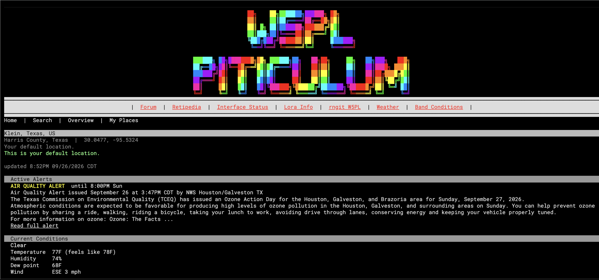
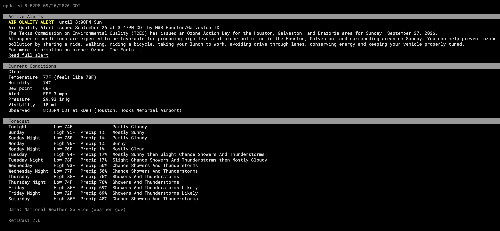
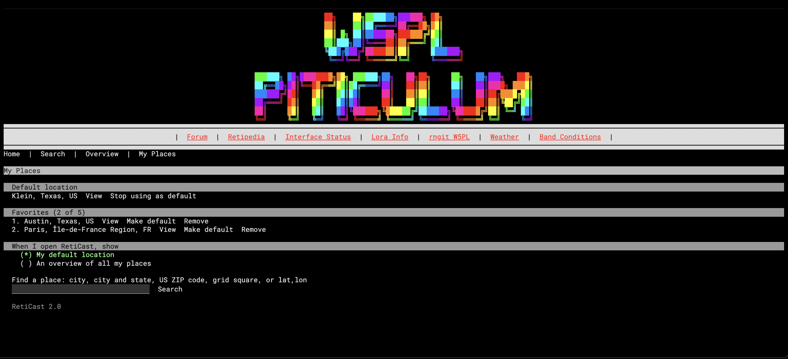

# RetiCast 2.0

Live weather for your NomadNet node, for any place in the world.

Visitors can look up the weather anywhere by city, city and state, US ZIP code, grid square, or latitude/longitude. Visitors who identify to your node can save a default location and up to 5 favorites. They can also choose whether RetiCast opens on their default location or on an overview of all their saved places. Everyone else sees the default location you choose for your node.

US locations get active watches, warnings, and advisories, current conditions, and a 7-day forecast from the National Weather Service. Places outside the US get current conditions and a 7-day forecast from Open-Meteo. No API keys are needed, and RetiCast uses only the Python standard library.

## Screenshots

The weather page for a visitor's default location, with an active alert and the "Read full alert" link:



Further down the same page, current conditions and the 7-day forecast:



The overview, which shows a short summary for each saved place:


My Places, where visitors manage their default location and favorites, and choose what RetiCast opens on:



The screenshots are from the W5PL Piticulum node. The banner and menu at the top come from that node's own site header, which RetiCast shows automatically (see [Using your site header](#using-your-site-header)).

## Features

- **Search anywhere:** by city (`Paris`), city and state (`Austin TX` or `Paris, Texas`), US ZIP code (`77002` or `77002-1234`), Maidenhead grid square (`EM20fb`), or latitude/longitude (`29.76,-95.37`).
- **Saved places for identified visitors:** one default location plus up to 5 favorites, remembered by the node.
- **Choice of landing page:** each visitor chooses whether RetiCast opens on their default location or on an overview of all their saved places.
- **Server default:** guests, and visitors who haven't saved a default, see the location you choose.
- **Alerts (US):** every active watch, warning, and advisory, color coded (warnings red, watches orange, advisories yellow). Long alerts are trimmed, with a "Read full alert" link to the complete text.
- **Current conditions:** temperature, feels like, humidity, dew point, wind and gusts, pressure, visibility, and the reporting station.
- **7-day forecast:** day and night periods for US locations, and daily highs and lows elsewhere.
- **Fast pages:** a cron job keeps the node's default and visitors' saved places up to date, so those pages load from saved data. If a weather service stops answering, RetiCast shows the last saved data and says so.
- **One-line summary:** a function you can use to put the current weather on your home page or any other page.
- **US or metric units.**

## Requirements

- A NomadNet node, with RetiCast installed as the same user that runs NomadNet
- Python 3.9 or newer (Raspberry Pi OS and current Linux distributions already have it)
- Internet access from the node, for the weather services
- `cron`, to keep the saved data fresh

## Install options

There are two ways to install RetiCast. Both give the same result:

- **Quick install:** run `install.sh`, which asks a few questions and does everything for you. This is best for most people.
- **Manual install:** copy the files and set things up by hand. Use this if you want to see every step, or if your setup is unusual.

Either way, install as the same user that runs NomadNet. RetiCast doesn't need `sudo`.

## Quick install

```
git clone https://github.com/jwheeler188/reticast.git
cd reticast
./install.sh
```

The installer asks for two things:

1. **The default location**, which is what visitors see before they save their own. Any search RetiCast accepts works, for example `EM20fb`, `Houston, TX`, `77002`, or `29.76,-95.37`.
2. **An email address or callsign.** The National Weather Service asks every app to identify itself with a way to reach its operator. It's sent to the weather services only, and isn't shown to visitors.

The installer then:

- installs `reticast.py` in `~/scripts` and the page in your NomadNet pages folder
- looks up your default location and shows what it found
- does a test run
- adds a cron job that refreshes the weather every 5 minutes

If this is a new install, restart NomadNet so it sees the new page. Then open `/page/reticast.mu` on your node.

### Installer options

Set any of these before `./install.sh` to change how it runs:

| Option | Default | What it does |
| --- | --- | --- |
| `LOCATION` | asks | The default location for visitors; skips the question |
| `GRID` | | Same as `LOCATION`; still accepted from RetiCast 1.x |
| `CONTACT` | asks | Your email or callsign; skips the question |
| `UNITS` | `us` | `us` (F, mph, inHg, miles) or `metric` (C, km/h, hPa, km) |
| `SCRIPTS_DIR` | `~/scripts` | Where `reticast.py` and its data go |
| `PAGES_DIR` | `~/.nomadnetwork/storage/pages` | Your NomadNet pages folder |
| `PYTHON` | output of `which python3` | The Python to use (3.9 or newer) |

For example, to install without any questions:

```
LOCATION=EM20fb CONTACT=W1AW ./install.sh
```

It's safe to run the installer again, for example to change your default location. When you run it again, it offers your current settings as the defaults, backs up the previous `reticast.py`, keeps visitors' saved places, and doesn't add a second cron job.

## Manual install

1. Copy `scripts/reticast.py` to `~/scripts/` and make it executable:

   ```
   mkdir -p ~/scripts
   cp scripts/reticast.py ~/scripts/
   chmod +x ~/scripts/reticast.py
   ```

2. Edit the settings at the top of `~/scripts/reticast.py`. At minimum, set `DEFAULT_LOCATION`, and put your email or callsign in `USER_AGENT`. See [Settings](#settings) for the rest.

3. Copy the page into your NomadNet pages folder:

   ```
   cp pages/reticast.mu ~/.nomadnetwork/storage/pages/
   chmod +x ~/.nomadnetwork/storage/pages/reticast.mu
   ```

4. Edit the first line of `reticast.mu` so it's the full path to your Python. Run `which python3` to find it, for example `#!/usr/bin/python3`. If `reticast.py` isn't in `~/scripts`, also change the `SCRIPTS_DIR` line.

5. Check your default location, then do a test run:

   ```
   ~/scripts/reticast.py --check
   ~/scripts/reticast.py --debug
   ```

6. Add the cron job with `crontab -e`, using your own paths:

   ```
   */5 * * * * /usr/bin/python3 /home/pi/scripts/reticast.py > /dev/null 2>&1
   ```

7. Restart NomadNet.

## Upgrading from RetiCast 1.x

Run the 2.0 installer. It reads your 1.x settings (`GRIDSQUARE`, your contact, and units) and offers them as the defaults, so pressing Enter at each question keeps them. The installer also:

- backs up your 1.x `reticast.py` as `reticast.py.bak.<date>`
- replaces the page with the 2.0 version
- removes the 1.x cache file, `reticast_cache.json`
- replaces the 1.x cron job instead of adding a second one

Things that stay the same:

- **Your home page.** `get_weather_string()`, `get_weather_title()`, and `get_weather_micron()` still exist and still describe your node's default location. A home page that shows the 1.x one-line summary keeps working unchanged.
- **Links.** The page is still `/page/reticast.mu`.

Things that change:

- `GRIDSQUARE` is now `DEFAULT_LOCATION`, and it accepts any location, not just a grid square.
- If you changed other settings in 1.x (such as `MAX_ALERT_CHARS`), they go back to their defaults. Your old copy is in the backup file if you want to reapply them.
- The page tells clients not to cache it, because it's now personal to each visitor.

## Using RetiCast

The menu at the top of the page has **Home** and **Search** for everyone, plus **Overview** and **My Places** for identified visitors.

### Searching

Type a place in the search box and select **Search**. Each result shows its name, country, and coordinates. Select a result to see its weather.

- **City and state:** a state narrows US results to that state. The comma is optional (`Paris TX`, `Paris, TX`, and `Paris, Texas` all work).
- **Other countries:** add the country to narrow the results, for example `Paris, France`.
- **Towns with the same name:** if two results in the same state would look identical, the county is added so you can tell them apart.
- **Grid squares and coordinates:** these don't need a lookup, so they work even if the place search service is unavailable.

### Saving places

To save places, a visitor needs to identify to your node in their NomadNet client first. RetiCast remembers their places by their identity, not by name or address, so they appear again on any client that uses the same identity.

On any place's weather page, and next to each search result, identified visitors can:

- **Make it their default.** Their default is what RetiCast opens on (unless they chose the overview). If the new default was a favorite, the two swap places. If it wasn't, the old default moves into their favorites if there's room.
- **Add it to their favorites,** up to 5.

### My Places

My Places shows a visitor's default and favorites. From there they can:

- view any saved place
- make a favorite their default
- remove a favorite
- stop using a place as their default
- choose what RetiCast opens on: their default location, or an overview of all their places (used once they have at least 2 saved places)

### Overview

The overview shows each saved place with its current temperature, conditions, humidity and wind, a short look ahead, and the names of any active alerts. Select a place's name for its full weather page.

### Alerts

For US locations, the page lists every active watch, warning, and advisory. Long alerts are trimmed; select **Read full alert** to see the complete alert on its own page, with the affected areas, full instructions, and the issuing NWS office. If an alert expires before someone opens it, the page says it's no longer active.

Weather alerts aren't available for places outside the US.

## Adding the weather to your home page

`get_weather_string()` returns a one-line summary for your node's default location, for example:

```
Current weather conditions for gridsquare EM20fb (Harris County, Texas) @ 8PM 09/26/2026: Temp. 77F, Humidity 74%, Clear
```

Active watches and warnings are added to the end of the line when there are any.

To show it on a page, with the word "Weather" linking to the full weather page:

```python
#!/usr/bin/python3
import os, sys
sys.path.insert(0, os.path.expanduser("~/scripts"))
from reticast import get_weather_string

print("`F0ff`!`_`[Weather`:/page/reticast.mu]`_`!: `Fddd" + get_weather_string() + "`f")
```

The summary is read from saved data, so it doesn't slow your home page down. The cron job keeps it fresh.

Other functions you can use the same way:

- `get_weather_title()` returns a short title, such as `Harris County, Texas (EM20fb)`.
- `get_weather_micron()` returns the full weather view (alerts, conditions, and forecast) for your default location, as Micron.

### Using your site header

If `~/scripts/site_parts.py` exists and has a `print_top()` function, RetiCast calls it at the top of every page, so the weather page shows your node's usual banner and menu. If the file isn't there, RetiCast simply starts with its own menu.

## Settings

All settings are at the top of `reticast.py`. The installer sets the first three for you.

| Setting | Default | What it does |
| --- | --- | --- |
| `DEFAULT_LOCATION` | `"EM20fb"` | What guests see. Any search works: grid square, `"City, ST"`, ZIP code, or `"lat,lon"` |
| `USER_AGENT` | `"(RetiCast, you@example.com)"` | Identifies your node to the weather services; put your email or callsign in it |
| `UNITS` | `"us"` | `"us"` or `"metric"` |
| `DEFAULT_LOCATION_NAME` | `""` | A display name for the default location (`""` = automatic) |
| `PAGE_PATH` | `"/page/reticast.mu"` | The page's path on your node; change it if you rename the page |
| `MAX_FAVORITES` | `5` | Favorites per visitor, not counting their default |
| `MAX_USERS` | `1000` | Most visitors who can save places on your node |
| `SEARCH_RESULTS` | `8` | Most results shown for a search |
| `ALERT_KEYWORDS` | `("Warning", "Watch")` | Alert types included in the one-line summary. Add `"Advisory"` for those too |
| `MAX_ALERT_CHARS` | `600` | Trim long alerts on the page and add a "Read full alert" link (`0` = never trim) |
| `FORECAST_PERIODS` | `14` | NWS forecast periods shown (14 = 7 days, day and night) |
| `CACHE_MINUTES` | `10` | How long current conditions and alerts are reused before asking again |
| `FORECAST_CACHE_MINUTES` | `30` | How long a forecast is reused |
| `RETRY_MINUTES` | `2` | After a failed update, how long to wait before trying again |
| `PREFETCH_LIMIT` | `50` | Most places the cron job refreshes per run |
| `PRUNE_DAYS` | `7` | Saved data for places nobody has saved is deleted after this many days |
| `TIMESTAMP_SOURCE` | `"now"` | Time shown in the one-line summary: `"now"` (when fetched) or `"observation"` (when the station took its reading) |
| `TIME_FORMAT` | `"%I%p %m/%d/%Y"` | Time format in the one-line summary |
| `MAX_STATIONS` | `3` | Nearby NWS stations to try if the closest has no current reading |
| `HTTP_TIMEOUT` | `8` | Seconds to wait for each web request |

After changing `DEFAULT_LOCATION`, run `~/scripts/reticast.py --check` to confirm what it resolves to.

## Commands

```
~/scripts/reticast.py              refresh saved places and print the one-line summary (what cron runs)
~/scripts/reticast.py --check      look up DEFAULT_LOCATION and show what it resolved to
~/scripts/reticast.py --search Q   test a search, e.g. --search "Austin TX"
~/scripts/reticast.py --page       print the full weather view for the default location
~/scripts/reticast.py --debug      add web request timings (works with the other commands)
```

## How it works

- **Weather:** US places (including Puerto Rico, Guam, and the other US territories) use the National Weather Service. For those, RetiCast looks up the county and the nearest stations once and saves them, then fetches current conditions, alerts, and the forecast. Everywhere else uses Open-Meteo.
- **Search:** US ZIP codes use Zippopotam.us. Place names use Open-Meteo's geocoding. Grid squares and coordinates are worked out locally. Searches are saved for 7 days.
- **Saved data:** current conditions and alerts are reused for 10 minutes, and forecasts for 30. Visiting a place nobody has looked at recently fetches it on the spot, which takes a few seconds.
- **Cron:** every 5 minutes, the cron job refreshes the node's default location and visitors' saved places, then cleans out old data. Only data that's out of date is fetched again.
- **Pages:** each visit runs `reticast.mu`, which builds the page for that visitor. NomadNet tells RetiCast who the visitor is when they've identified.

### Files

Everything RetiCast saves is in `~/scripts/reticast_data/`, which is private to the NomadNet user:

| File | What it holds |
| --- | --- |
| `users.json` | Each identified visitor's saved places and landing page choice |
| `server_default.json` | Your default location as it was looked up |
| `cache/` | Saved weather, location details, and search results |

You can delete `cache/` at any time; it's rebuilt as needed. Deleting `users.json` erases all visitors' saved places.

## Privacy

For visitors who save places, RetiCast stores their identity hash (the same public identifier NomadNet uses for them), their saved places, and their landing page choice. That's all. Nothing is stored for visitors who only look at the weather.

Place searches go to Open-Meteo or Zippopotam.us, and weather requests go to the National Weather Service or Open-Meteo. These requests come from your node, not the visitor, and don't include anything about the visitor.

## Troubleshooting

**The page shows "Weather data isn't available for this place right now."**
The weather service didn't answer. RetiCast tries again after `RETRY_MINUTES`. Run `~/scripts/reticast.py --debug` to see each request and how it went.

**"This node's default location couldn't be looked up right now."**
Run `~/scripts/reticast.py --check`. If the lookup fails, check the spelling of `DEFAULT_LOCATION` (adding a state or country helps), or use a grid square or coordinates, which don't need a lookup.

**The page shows "saved data - the weather service didn't answer."**
RetiCast is showing the last good data because an update failed. This usually clears up on its own. If it doesn't, check that the cron job is running with `crontab -l`, and that the node can reach the internet.

**Visitors can't save places.**
They need to identify to your node in their client first. The page says "You're browsing as a guest" until they do.

**A search finds nothing.**
Try adding a state or country (`Springfield, IL`), or use a ZIP code, grid square, or coordinates.

**The page doesn't load at all.**
Check that the first line of `reticast.mu` is the full path to Python, that both `reticast.mu` and `reticast.py` are executable, and that the `SCRIPTS_DIR` line in `reticast.mu` points at the folder containing `reticast.py`. Running the page directly, for example `~/.nomadnetwork/storage/pages/reticast.mu`, shows any error.

## Data sources and fair use

- [National Weather Service API](https://www.weather.gov/documentation/services-web-api): US weather and alerts
- [Open-Meteo](https://open-meteo.com): weather outside the US, and place search. Free for non-commercial use.
- [Zippopotam.us](https://zippopotam.us): US ZIP codes

Please keep your contact in `USER_AGENT` so the services can reach you if there's a problem, and keep the cache settings at or above their defaults.

## License

RetiCast is released into the public domain under the [Unlicense](LICENSE).

This software is possible because my parents believed in me and encouraged me to follow my passions.
